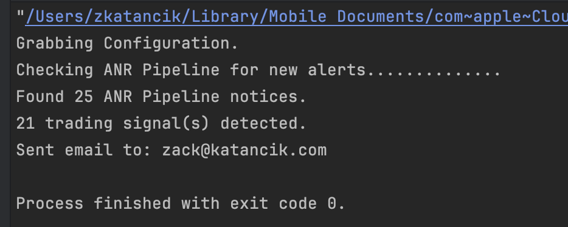
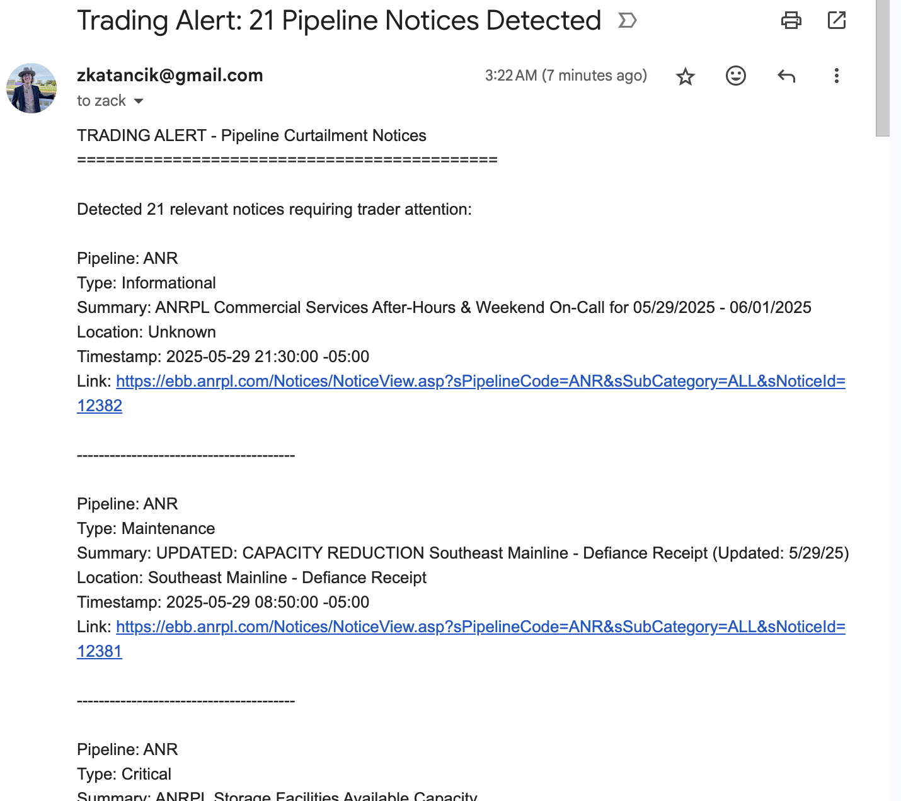
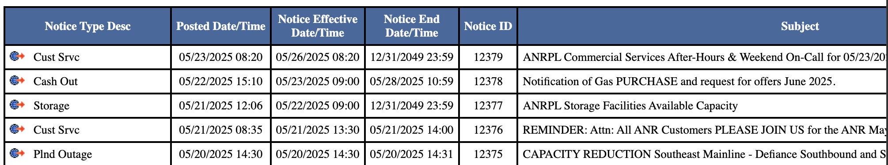
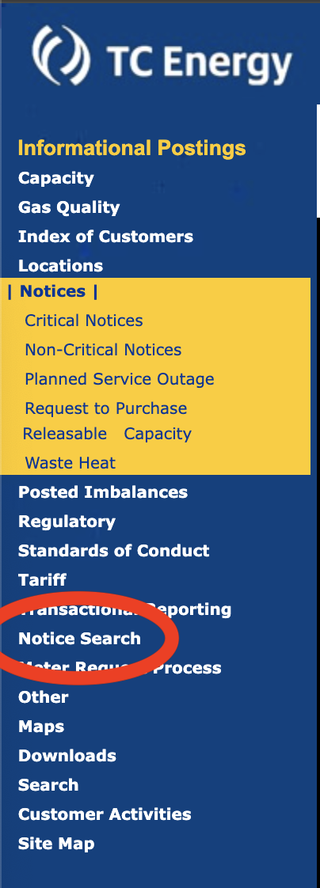

# TradeAlerter - Automated Trading Alert System

## Summary

A C# console application that monitors natural gas pipeline electronic bulletin boards (EBBs) for curtailment notices, outages, and force majeure events that may impact energy trading decisions near Henry Hub and Louisiana-based terminals and sends an email notification if events are found. The system currently supports ANR pipeline monitoring with a modular architecture designed for easy expansion to additional pipelines and notification mediums.



## Setup and Running the App

### Prerequisites

- .NET 9.0 SDK (but I thiiiink it will run on .NET 6.0+, just untested)
- Docker (optional, for containerized deployment)

### Local Development Setup

1. **Clone the repository**

   ```bash
   git clone https://github.com/zkatancik/trade-alerter.git (or git@github.com:zkatancik/trade-alerter.git for SSH if you prefer)
   cd TradeAlerter
   ```

2. **Environment Configuration**

   Create a `.env` file in the `TradeAlerter/` directory:

   ```env
   EMAIL_USERNAME=your-email-username  # for Gmail likely your-email@gmail.com
   EMAIL_PASSWORD=your-email-password  # see https://support.google.com/accounts/answer/185833 for Gmail passwords
   ```

3. **Configuration Setup**

   Update `appsettings.json` with your email settings:

   ```json
   {
     "Email": {
       "SmtpServer": "smtp.gmail.com",
       "SmtpPort": 587,
       "EnableSsl": true,
       "FromEmail": "your-email@gmail.com",
       "ToEmail": "recipient@domain.com"
     }
   }
   ```

4. **Build and Run**
   ```bash
   cd TradeAlerter
   dotnet restore
   dotnet build
   dotnet run
   ```

### Email Notification

When relevant trading notices are detected, you'll receive an email notification like this:



### Running with Docker

1. **Build Docker Image**

   ```bash
   # From the solution root directory
   docker build -f TradeAlerter/Dockerfile -t tradealerter .
   ```

2a. **Run with Environment Variables**

```bash
docker run \
  -e EMAIL_USERNAME="your-email-username" \ # for Gmail likely your-email@gmail.com
  -e EMAIL_PASSWORD="your-email-password" \  # see https://support.google.com/accounts/answer/185833 for Gmail passwords
  tradealerter
```

**OR**

2b. **Run with .env file**

```bash
docker run --env-file TradeAlerter/.env tradealerter
```

#### Other SMTP Providers

Update the `SmtpServer` and `SmtpPort` in `appsettings.json` according to your provider's settings.

## Configuration

### Pipeline Configuration

Currently supports ANR pipeline with configurable parameters:

- `BaseUrl`: Link to the table view "Notice Search" page that shows all notices. Currently pretty locked to: https://ebb.anrpl.com/Notices/NoticesSearch.asp?sPipelineCode=ANR
- `LookbackDays`: Number of days back in time to scan for notices (default: 31)

### Trading Signal Detection Rules

The system identifies relevant notices based on:

- Keywords in title or content: "Force Majeure", "Outage", "Curtailment"
- Geographic relevance: Louisiana locations, Henry Hub connections mentioned in title, description, or extracted location
- Recency relevance: Notices within the last 3 days
- Volume impact: Curtailment volumes when available

These are hard-coded, but could be configured easily in the future by adding additional config options to the appsettings file.

### Scheduling with cron or Windows Task Scheduler

For production use, we can schedule the application to run at regular intervals to check for new trading notices.

#### Linux/macOS with cron

1. **Schedule every 15 minutes during the week**:

   ```bash
   crontab -e

   # Add entry (runs every 15 minutes, 6 AM - 6 PM, Monday-Friday CST)
   */15 6-18 * * 1-5 cd /path/to/TradeAlerter && dotnet run
   ```

2. **For Docker**:
   ```bash
   */15 6-18 * * 1-5 docker run --env-file /path/to/.env tradealerter
   ```

#### Windows Task Scheduler

1. **Open Task Scheduler** -> Create Basic Task
2. **Configure trigger**:
   - Daily, repeat every 15 minutes
   - Start time: 6:00 AM
   - Expire: 6:00 PM
   - Days: Monday through Friday
3. **Action**: Start a program
   - Program: `dotnet`
   - Arguments: `run`
   - Start in: `C:\path\to\TradeAlerter`

**Note**: Adjust frequency based on pipeline update patterns and trading requirements. Consider rate limiting to avoid getting blocked.

## Architecture

### Overview

The application follows a layered architecture pattern with clear separation of concerns:

- **Host Layer**: Application entry point, dependency injection container setup, and configuration management
- **Domain Layer**: Core business logic like enums, models, interfaces, and other abstractions
- **Plugins Layer**: Concrete implementations of scrapers, notices, and notifiers

### Design Patterns

- **Strategy Pattern**: Implemented through `IScraper` and `INotifier` interfaces, allowing easy addition of new pipelines and notification methods
- **Dependency Injection**: Microsoft.Extensions.DependencyInjection for flexibility and testability
- **Plugin Architecture**: Modular design enabling extensibility without core changes

### Key Components

#### Domain Models

- `INotice`: Core abstraction for pipeline notices with trading signal detection logic in isRelevant
- `Pipeline`: Enumeration of supported pipelines
- `NoticeType`: Enumeration of notice types (Critical, Maintenance, etc.)

#### Scrapers (ANR Scraper Implementation)

- `AnrScraper`: HTML parsing implementation for ANR pipeline EBB using the Notice Search table on: https://ebb.anrpl.com/Notices/NoticesSearch.asp?sPipelineCode=ANR.
- Makes an HTTP POST call to ANR's search endpoint for notices in {LookbackDays} posted range to get a table with all issues from {LookbackDays} to now.



- Scrapes the table for the notification "full details" link, then follows that link for each notice in the table.
- Scrapes the full details page like the one here: https://ebb.anrpl.com/Notices/NoticeView.asp?sPipelineCode=ANR&sSubCategory=ALL&sNoticeId=12358 for Notice Type (mapped to the enum in the Scraper), TimeStamp, Summary, and "Full Text".
- Then the "Notice" implementation takes over. The AnrNotice uses REGEX to analyze the "Full Text" for the Notice's Location and Curtailment Volume.
- Notice also sets a bool "IsRelevant" based on the properties collected by the scraper and the hard-coded properties above to deem relevance.
- Can be run async (and is in my implementation) and returns a list of all scraped notices.

#### Notifiers

- `EmailNotifier`: SMTP-based email notification system. Sends a hard-coded email but could use a template system in the future.
- Future support for Slack webhooks and other notification channels

### Dependency Injection Framework

The application uses Microsoft.Extensions.DependencyInjection with:

- Keyed services for pipeline-specific scrapers
- Options pattern for configuration binding with environment variable overrides
- HttpClient factory for HTTP operations

## Production Considerations

To evolve this into a robust production system:

#### Infrastructure

- **Database**: Add persistent storage for notice history and deduplication

#### Monitoring and Observability

- **Health Checks**: Implement endpoint monitoring and alerting

#### Other things that come to mind:

- **Configuration-Driven**: Move hardcoded rules to external configuration
- **Webhook Support**: Add Slack and custom webhook notifications
- **Multi-Pipeline**: Support monitoring of multiple pipelines
- **Abstract Datasource**: Better use Dependency Injection to abstract out the datasource (the table being scraped) for easier testing.

### Testing Strategy

#### Unit Testing

- **Using DI and Mocks**: Implement unit tests with dependency injection for mocking, as mention above abstract the datasource better

#### Integration Testing

- **HTTP Testing**: Mock external pipeline APIs for consistent test execution
- **End-to-End Testing**: Validate complete notification workflow periodically

#### Performance Testing

- **Load Testing**: Scrape large amounts of notices (365 days?)

### Design Trade-Offs, Concerns, and Ambiguity

#### Search Table vs. Notices Pages



I grappled with two options when deciding which part of ANR to scrape: the "Notice Search" page (https://ebb.anrpl.com/Notices/NoticesSearch.asp?sPipelineCode=ANR) or the list of categorized notices accessible for download via the "Notices" section on ANR's site (https://ebb.anrpl.com/Notices/NoticesDL.asp?sDownload=Y&sPipelineCode=ANR&sSubCategory=Critical), for example. Ultimately, I opted for the search page primarily because the downloadable pages didn't seem to contain all notices that the search page did. Though it is much slower (I have to scrape the table, then make a GET request for every notice), I feel the result set is more complete.

#### "UPDATED" Notices

I noticed that many notices tend to be "Updated" inline. These updates might contain valuable flow intel or other relevant information and should be considered as "new" notices potentially.

#### Where to Use Dependency Injection, Where is it Unnecessary Complexity?

I tried to design this as modular as possible, but only where it made sense. For example, I felt like scrapers, for the most part, would be better as pure inheritance rather than Dependency Injected modules. My thinking for this is that it would just add extra complexity because, in general, a scraper's implementation has to be pretty rigid to the makeup of the data being scraped without much room for interchangeable parts. One part that may make sense down the line is injecting the "datasource," allowing for mock HTTP endpoints, preconstructed tables, etc. for testing or validation without actually having to query ANR.

#### Utilize ANR's Filtered Search More?

In my scraper I make a POST request with one parameter, LookbackDays. This shortens the table so we don't load thousands of notices to scrape through. There's potential that we could improve the performance and accuracy of this scraper in finding relevant trading signals by exploring other filters ANR's search provides.

#### Currently Lots of Relevant Notices, Stricter Filters?

We return a lot of "trading signals" as our "isRelevant" filters are pretty broad. Currently all maintenance, planned outages, recent postings, things that mention a flow rate, and posts that mention Louisiana or Henry Hub pipelines are marked relevant, which seems to be a high percentage of notifications.

#### Locations, Zones, States, Codes... and More?

I utilized a location data sheet I found on ANR's site (AnrLocationData.csv) to further narrow down probable referenced locations. The sheet gives location codes, names, zones, states, and more. While I do use it for basic location matching by name, with further analysis of this sheet we could have greater accuracy in our scraper when pinpointing relevant locations to be alerted on.

#### Scrapers Get Blocked

In prod, it would be good to have some sort of retry logic or rate limiting implemented to prevent being blocked by our data sources. In general we want our bot to look as much like regular web traffic as possible, so implmenting as much "steath" as we can with some retries for the odd blocked request would be prudent.
